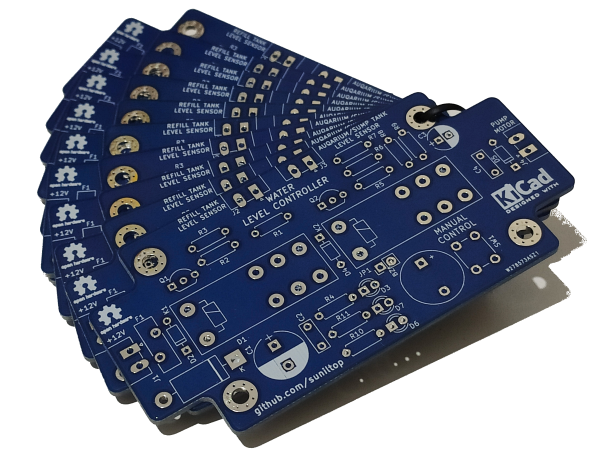

# Aquarium-Water-Level-Controller

Description

* This circuit designed for espically saltwater aquarium lovers.
* Old school design only through hole package type component is used. Thus handmade soldering is easy for all.
* No MCU, No Firmware :)

PCB picture saved from KiCAD with Raytracing

  

- Green Led: Everything is fine.
- Yellow Led: Water pump is runnning so, filling aquarium tank or sump tank.
- Red Led: Refill tank is empty.

PCB Picture

  

